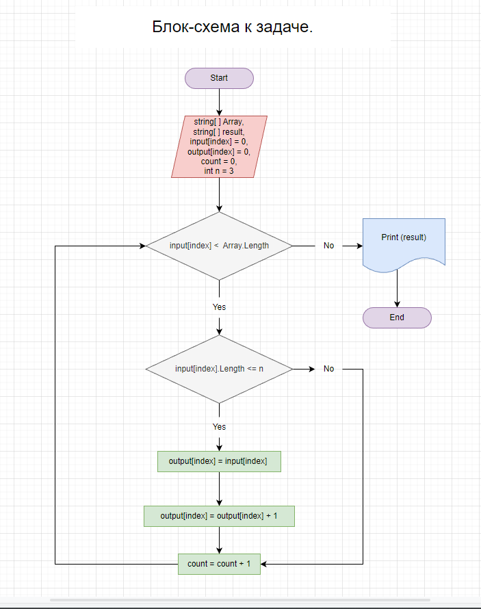

# Итоговая проверочная работа.
Данная работа необходима для проверки знаний и навыков по итогу прохождения первого блока обучения по программе разработчик.

## Для выполнения проверочной работы необходимо:

1. Создать репозиторий на GitHub.
2. Нарисовать блок-схему алгоритма.
3. Снабдить репозиторий оформленным текстовым описанием решения (readme.md)
4. Написать программу, решающую поставленную задачу.

## **Задача**: 
### Написать программу, которая из имеющегося массива строк формирует массив строк, длина которых меньше либо равна 3 символа. Первоначальный массив можно ввести с клавиатуры, либо задать на старте выполнения алгоритма.

## *Примеры*:
["hello", "2", "world", ":-"] -> ["2", ":-"]

["1234", "1567", "-2", "computer science"] -> ["-2 "]

["Russia", "Denmark", "Kazan"] -> [ ]

# *Блок-схема алгоритма:"*

# *Алгоритм решения задачи:*
* ### Инициализируем вспомогательную переменную *count = 0*, в которую запишем количество строк, длина которых 3 символа и меньше.
* ### Вычисляем количество строк, длинна которых меньше либо равна 3 символа.
*В цикле проходим по каждой строке массива. На каждой итерации сверяем длину строки - если длина меньше или равна трём, инкрементируем ранее инициализируемую переменную count и инкрементируем счётчик цикла. Если длина больше трёх, инкрементируем только счётчик цикла.*
* ### Инициализируем массив результатов размером count.
* ### Формируем массив с результатами.
*Снова в цикле проходим по каждой строке и также сравниваем на каждой итерации длину строки. По окончании выборки нам становится известно количество отобранных элементов и мы создаем результирующий массив необходимой длинны, при этом удаляя лишнии (пустые) элементы.*
* ### Выводим массив результатов в консоль